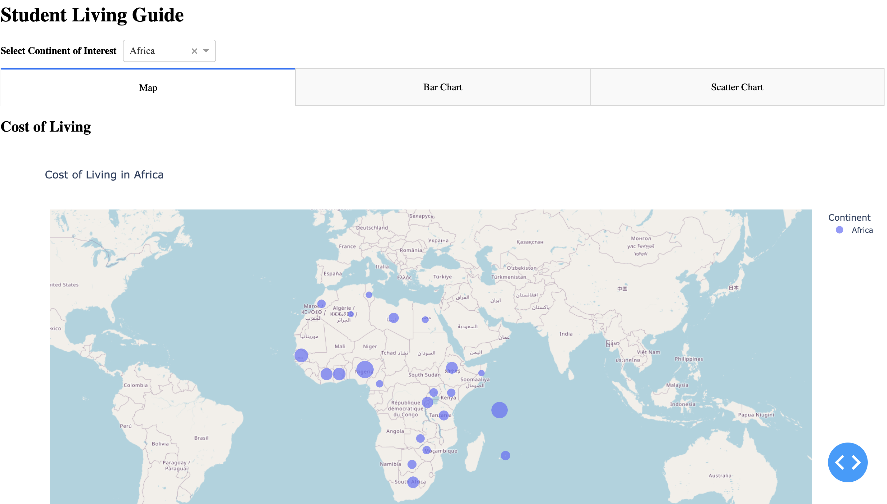
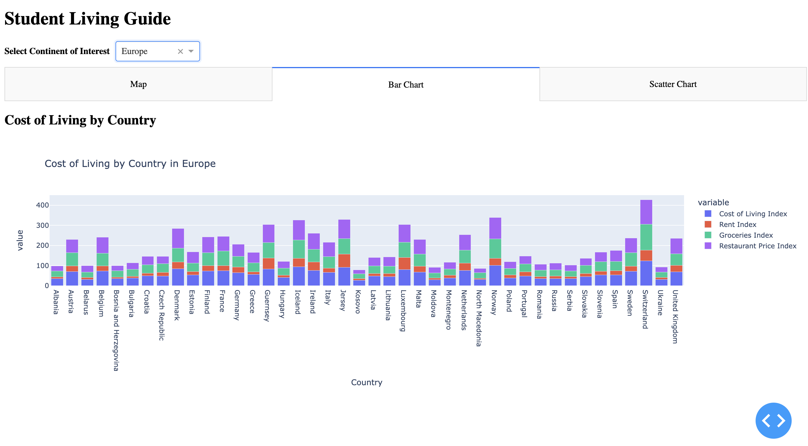
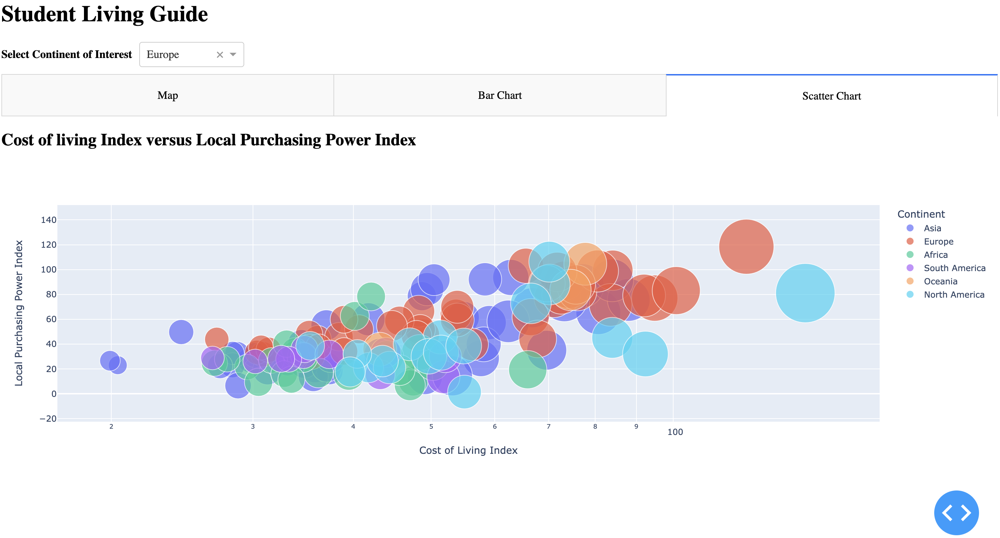

# Student Living Guide Dash App

Click [here](https://student-living-guide-dash.onrender.com/) to see the live application on render.com

The Student Living Guide is a data visualization dashboard app (built on Dash) displaying crucial information about cost of Living indexes of different countries and continents. The data at hand gives the cost of living indexes compared to New York. Therefore, this app is made for any student or anybody in New York city wishing to explore other parts of the world for academic or any other purpose. 

## Proposal

Thanks to this app, the targeted audience mentioned above, will be able to support the target audience detailed on this [proposal](https://github.com/UBC-MDS/Student_Living_Guide/blob/main/reports/proposal.md) to view and compare indexes attributes about countries such as Rent index, Groceries index, Cost of Living index, to make their choices on which country to go based on their budget.

You can read more about the proposal proposal [here](https://github.com/UBC-MDS/Student_Living_Guide/blob/main/reports/proposal.md). 

### App description:

Student Living Guide Dash App is an app as mentionned above which helps New York based students and residents in general to compare the cost of living of countries. 
With this app, they will be able to:

#. Have a dropdown with all the  different continents in the dataset.

#.View 3 Tabs  which are labelled:

* Map: This tab shows a map which shows the Cost of Living per country based on the selected continent. The cost of living varies depending on the size of the circle. The bigger the circle, the higher the cost of living. It also hovers the continent name, the rent index and the latitude and longitude.




* Bar chart: This tab shows a stacked bar chart of the cost of living index, rent index, groceries index, restaurant price index per country based on the selected continent.


* Scatter plot: This is tab shows a scatter plot of the  cost of living versus the local purchase power index.



## App Usage

1. Fork [the repository](https://github.com/florawendy19/Student_living_guide_dash/)

2. Set up conda environment as follows

```bash
conda env create -f env.yaml
conda activate dash
```

3. To run the app locally, run the following command from the root of this repository

```python
python src/app.py
```

4. Create an issue on this repo to inform the owner about the changes/improvements you want to make. See below how to contribute to this project.

## Contributing

Interested in contributing? Check out the contributing guidelines [here](https://github.com/florawendy19/Student_living_guide_dash/blob/main/CONTRIBUTING.md).
Please note that this project is released with a [Code of Conduct](https://github.com/florawendy19/Student_living_guide_dash/blob/main/CODE_OF_CONDUCT.md). By contributing to this project, you agree to abide by its terms.

## App Contributors

-Flora Wendmalgdo ouedraogo

## License

`Student_living_guide_dash` was created by Flora Ouedraogo. It is licensed under the terms of the [MIT License](https://github.com/florawendy19/Student_living_guide_dash/blob/main/LICENSE).
